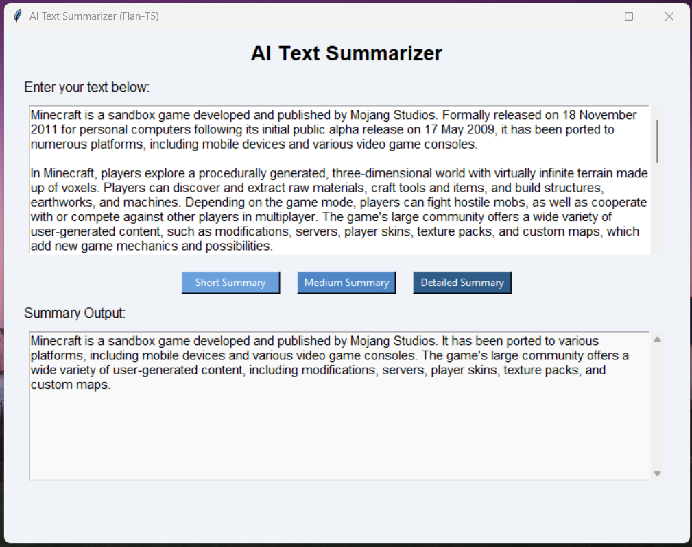

# 🧠 AI Text Summarizer (Flan-T5)

A simple and interactive **Text Summarization App** built with **Python**, **Tkinter**, and **Hugging Face Transformers**.  
It uses the `google/flan-t5-small` model to summarize any paragraph into **short**, **medium**, or **detailed** summaries.

---

## 📸 Preview



---

## 🚀 Features

- 📝 Paste or type any paragraph of text  
- ⚙️ Choose summary length (**Short**, **Medium**, or **Detailed**)  
- 💡 Uses Google’s **Flan-T5** model for accurate summarization  
- 🧰 Built with a clean **Tkinter UI**  
- 🔁 Automatically clears old summaries for a smooth user experience  

---

## 🧩 Tech Stack

| Component | Technology |
|------------|-------------|
| UI | Tkinter |
| Model | google/flan-t5-small |
| Backend | Hugging Face Transformers |
| Language | Python 3.10+ |

---

## 🖥️ Installation

1. Clone this repository:
   ```bash
   git clone https://github.com/<your-username>/AI-Text-Summarizer.git
   cd AI-Text-Summarizer
   ```

2. Create a virtual environment (optional but recommended):
   ```bash
   python -m venv venv
   venv\Scripts\activate       # for Windows
   source venv/bin/activate    # for macOS/Linux
   ```

3. Install dependencies:
   ```bash
   pip install -r requirements.txt
   ```

4. Run the app:
   ```bash
   python summarizer_app.py
   ```

---

## 🧠 Example

**Input:**
> Minecraft is a sandbox game developed and published by Mojang Studios. Formally released on 18 November 2011...

**Short Summary Output:**
> Minecraft is a sandbox game developed by Mojang Studios. It has been ported to many platforms with a large community of user-generated content.

---

## 📦 Model Info

- Model: [`google/flan-t5-small`](https://huggingface.co/google/flan-t5-small)
- Framework: [Transformers](https://huggingface.co/docs/transformers/index)
- Size: ~308 MB (downloaded automatically on first run)

---

## 🧑‍💻 Author

**Yahan**  
🎓 Software Engineering Student | 💻 Data Science & NLP Enthusiast  
📧 Reach me on GitHub: [@<madhuhansa>](https://github.com/<madhuhansa>)

---

⭐ **If you like this project, please give it a star!**
